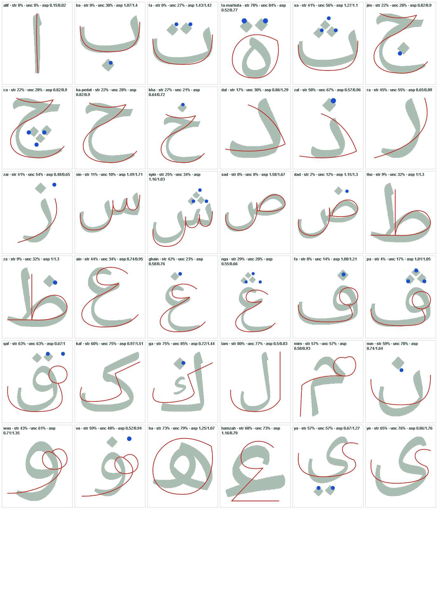

# Tracing models that match the catalogue letters

**Prepared:** 4 October 2026, Asia/Kuala_Lumpur.  
**Status:** Implemented on 4 October 2026 after the user asked to proceed with this
document; see [delivery and verification](GLYPH_MATCHED_TRACING_MODELS_VERIFICATION.md).
The text below is the proposal as authorised and is preserved as written. Sa and Syin were
left unchanged because they already met the acceptance numbers.  
**Request:** In **Isi kandungan** the letters look right, but the tracing game
draws several of them very differently. Check all letters, then plan how to make
every tracing model the same alphabet and shape as the catalogue.

## What was checked

For all 37 entries, the catalogue letter (what **Isi kandungan** shows) was
compared with the authored tracing model (what the game draws and what the
child must follow). Both were rendered in one box at the same scale, with the
model centreline over the catalogue form:

Measurements are recorded in
[`output/verification/glyph-model-audit/metrics-before.json`](../output/verification/glyph-model-audit/metrics-before.json).
The audit used the catalogue's own font (Noto Naskh Arabic, isolated forms) as the
reference. The audit is not a teacher assessment and does not replace the review
described below.

### Why they differ

The catalogue draws `letter.glyph` through a font for every letter except Kaf and
Ga (`usesModelGlyph` in [LetterModelGlyph.jsx](../src/components/LetterModelGlyph.jsx)).
Tracing draws the hand-authored path in
[letters.json](../src/content/letters.json), which is a simplified, wide,
uniform-weight route. Nothing keeps the two in step, so they drift apart.

### Result by letter

**Stray %** is the share of model centreline that lies outside the catalogue ink.
**Uncovered %** is the share of catalogue ink with no model route near it. Both use
a shared bounding box, so dotted letters are penalised slightly; a visual check
decided every tier. **Aspect** is width ÷ height.

| Tier | Meaning | Count |
| --- | --- | ---: |
| **Match** | Same shape; only stroke weight and dot style differ | 8 |
| **Refine** | Same structure; proportions or tail length visibly off | 10 |
| **Redraw** | Visibly a different shape from the catalogue letter | 17 |
| **Out of scope** | Kaf and Ga (see decisions) | 2 |

| # | Letter | Rev. | Tier | Stray % | Uncovered % | Aspect font / model | Observation |
| --- | --- | --- | --- | ---: | ---: | --- | --- |
| 1 | Alif | 1 | **Match** | 0 | 0 | 0.15 / 0.02 | Same shape; only stroke weight and dot style differ |
| 2 | Ba | 1 | **Match** | 0 | 30 | 1.07 / 1.4 | Same shape; only stroke weight and dot style differ |
| 3 | Ta | 1 | **Match** | 0 | 27 | 1.43 / 1.42 | Same shape; only stroke weight and dot style differ |
| 4 | Ta marbutah | 2 | **Redraw** | 78 | 84 | 0.52 / 0.77 | Plain ring; the catalogue form is the compact ة with a tail |
| 5 | Sa | 2 | **Refine** | 41 | 56 | 1.27 / 1.1 | Bowl slightly wide; dots fine |
| 6 | Jim | 2 | **Refine** | 22 | 28 | 0.82 / 0.9 | Tail slightly long |
| 7 | Ca | 2 | **Refine** | 22 | 28 | 0.82 / 0.9 | Same body as Jim |
| 8 | Ha (ح) | 2 | **Refine** | 22 | 28 | 0.82 / 0.9 | Same body as Jim |
| 9 | Kha | 2 | **Refine** | 27 | 21 | 0.64 / 0.72 | Tail slightly long |
| 10 | Dal | 1 | **Refine** | 17 | 30 | 0.86 / 1.29 | Arc larger and rounder than the font form |
| 11 | Zal | 2 | **Redraw** | 58 | 67 | 0.57 / 0.96 | Arc too large and round; font form is compact with a short hooked base |
| 12 | Ra | 1 | **Redraw** | 45 | 55 | 0.65 / 0.89 | Wide sweeping arc; font form is a short hook with a descending tail |
| 13 | Zai | 2 | **Redraw** | 41 | 54 | 0.48 / 0.65 | Same sweeping arc as Ra; proportions and tail differ |
| 14 | Sin | 1 | **Match** | 11 | 10 | 1.49 / 1.71 | Same shape; only stroke weight and dot style differ |
| 15 | Syin | 2 | **Refine** | 25 | 34 | 1.16 / 1.03 | Bowl slightly wide |
| 16 | Sad | 2 | **Match** | 0 | 8 | 1.58 / 1.67 | Same shape; only stroke weight and dot style differ |
| 17 | Dad | 2 | **Match** | 2 | 12 | 1.15 / 1.3 | Same shape; only stroke weight and dot style differ |
| 18 | Ta (ط) | 2 | **Refine** | 9 | 32 | 1 / 1.3 | Base tail longer than the font form |
| 19 | Za | 2 | **Refine** | 9 | 32 | 1 / 1.3 | Base tail longer than the font form |
| 20 | Ain | 2 | **Redraw** | 44 | 34 | 0.74 / 0.95 | Oversized upper loop and wide lower bowl; font form is narrower with a smaller head |
| 21 | Ghain | 2 | **Redraw** | 42 | 23 | 0.58 / 0.76 | Same head/bowl proportions as Ain |
| 22 | Nga | 2 | **Refine** | 29 | 20 | 0.55 / 0.66 | Head slightly large |
| 23 | Fa | 2 | **Match** | 8 | 14 | 1.08 / 1.21 | Same shape; only stroke weight and dot style differ |
| 24 | Pa | 2 | **Match** | 4 | 17 | 1.01 / 1.05 | Same shape; only stroke weight and dot style differ |
| 25 | Qaf | 2 | **Redraw** | 63 | 63 | 0.67 / 1 | Open U-bowl with a detached loop; font form is a compact head with a tail curling left |
| 26 | Kaf | 2 | **Out of scope** | 60 | 75 | 0.97 / 1.51 | Shaped to the earlier reference image; awaits review |
| 27 | Ga | 3 | **Out of scope** | 75 | 85 | 0.72 / 1.44 | Shaped to the earlier reference image; awaits review |
| 28 | Lam | 1 | **Redraw** | 80 | 77 | 0.5 / 0.83 | Wide U base plus a straight right stem; font form is a slanted stem with a tapered tail |
| 29 | Mim | 1 | **Redraw** | 57 | 57 | 0.58 / 0.93 | Polygonal stem with a loop; font form is a rounded head with a descending tapered tail |
| 30 | Nun | 1 | **Redraw** | 59 | 70 | 0.74 / 1.64 | Very wide shallow U; font form is narrow with a deeper bowl |
| 31 | Wau | 1 | **Redraw** | 43 | 61 | 0.71 / 1.35 | Loop too small and the tail sweeps left; font form has a closed head and a short tail below |
| 32 | Va | 2 | **Redraw** | 59 | 48 | 0.52 / 0.94 | As Wau, with the dot above |
| 33 | Ha (ه) | 2 | **Redraw** | 73 | 79 | 1.25 / 1.07 | Large plain ring; font form is the Naskh ه with two linked loops |
| 34 | Hamzah | 2 | **Redraw** | 68 | 73 | 1.16 / 0.79 | Large 3-like stroke; font form is a small comma-like ء |
| 35 | Ya | 1 | **Redraw** | 57 | 57 | 0.67 / 1.27 | Wide bowl with a long swoosh; font form is narrow with a deep curved tail |
| 36 | Ye | 2 | **Redraw** | 65 | 76 | 0.86 / 1.76 | Wide bowl with a long swoosh |
| 37 | Nya | 2 | **Redraw** | 61 | 56 | 0.69 / 1.13 | Wide shallow U with three dots; font form is narrow with a deeper bowl |

Dot counts agree for every letter. The font draws diamond dots and the game draws
round dots; that is a style choice and is not treated as a mismatch.

## Decisions needed before implementation

1. **Which side is the truth.** This plan keeps the catalogue as the reference and
   redraws the tracing models to match it, because you said the catalogue letters look
   right. The alternative, drawing the catalogue from the
   tracing models (as done for Kaf and Ga), would make the catalogue look like
   the simplified route and is not proposed.
2. **Kaf and Ga stay as they are.** They were deliberately shaped to your earlier
   reference image and still await review, so this plan does not touch them.
   They also differ from the catalogue font. Say so if you want them realigned.
3. **Student availability while models await review.** A geometry change needs a
   new content revision and fresh review ([AGENTS.md](../AGENTS.md)). Redrawn letters
   would leave the student and scored pools until reviewed. Today 35 lessons are
   approved; redrawing the 17 **Redraw** letters leaves 18 for pupils, and the
   10 **Refine** letters would leave 8 if all are changed. Recommended: adult
   preview shows each revised letter at once; you review a sheet per batch and
   approve whole batches so pupils regain them quickly. Nothing is approved on your
   behalf.
4. **Refine tier.** Recommended in scope as the last batch, but each Refine letter
   is changed only if its overlay is not acceptable to you after the Redraw
   batches. Reply with the letters to drop.

## Design

1. **Reference.** Use the catalogue glyph shown in Isi kandungan as the shape
   reference for each letter. The tracing model must follow its silhouette,
   proportions, connections, loops and tails.
2. **Centreline extraction.** For each letter, rasterise the catalogue form at high
   resolution, thin it to a centreline, remove spurs, order it from the writing
   start to the end, and fit smooth curves. This gives the geometry; **the writing
   order and pen lifts are authored separately** as a proposal for review. They
   are not claimed to be what the font specifies.
3. **Authoring frame.** Keep the existing 1000 × 1000 logical frame, baseline and
   stroke widths for the existing models. Preserve each letter's id, stroke ids,
   dot ids and valid sequence where the new shape keeps the same structure. Change
   the structure (for example merging a detached loop into the body) only where the
   catalogue shape requires it, and record it per letter.
4. **Dots.** Keep the round dot style, the existing tap-only policy, equivalent
   dot button and tolerances. Reposition dots to the font's positions relative to
   the new body, in the font's count and order.
5. **Single source of truth.** Keep `src/content/letters.json` and its validator as the
   source of truth. Do not draw model shapes from a font at runtime, and do not
   broaden matcher tolerances to make a model pass.
6. **No display change.** The catalogue, help and completion illustrations keep
   the font form. After the redraw they agree with tracing.
7. **Keep them in step.** Add a reusable comparison script,
   `scripts/compare-model-to-glyph.mjs`, based on this audit. It writes the same
   overlay sheet and metrics, so a later edit that drifts from the catalogue is
   caught. It fixes the audit's dot detection, which missed some dots in letters
   with a small body.

**Acceptance for a redrawn letter** (all required): mean distance ≤ 3.5%,
stray ≤ 30% and uncovered ≤ 35% of the box; aspect within 20% of the catalogue
form; identical dot count; and your visual approval of the overlay at phone and
tablet size. The numbers are an engineering gate, not a replacement for the review.

## Content revision and review

Increment only the changed letters' content revisions, set their geometry to
`pendingReview` and remove stale current-geometry review metadata. Preserve
historical approval entries, name recordings, recording versions and their
independent audio approvals. Record the actual reviewer, date, scope and
revision when you approve. Project-owner approval is labelled as such; no
teacher assessment is invented. Saying **proceed** authorises implementation; it is
not approval of drawings that have not been produced.

Existing attempts, copies and match records keep their original revisions.
Completion stickers already check content revisions; verify that an old
completion does not complete a revised letter.

## Planned work after authorisation

| File/area | Purpose |
| --- | --- |
| `src/content/letters.json` | Revised paths, dots, sequence, content versions and review state for the changed letters only. |
| `scripts/compare-model-to-glyph.mjs` (new) | Repeatable overlay sheet and metrics, with the thresholds above. |
| `output/verification/glyph-model-audit/` | Before and after metrics; sheets for review. |
| `tests/geometry/`, `tests/game/` | Versions bumped only for changed letters, structure valid, unchanged entries byte-identical. |
| `tests/browser/` | Complete every changed letter in each practice mode, plus invalid shortcuts. |
| Numbered-guide plan, matcher, tracing renderer | Reuse. Change only if a redrawn model exposes a specific failure. |
| Review and state documents | Record the change and the genuine review outcome; keep historical records. |

## Work sequence

1. Snapshot every entry, name recording and approval record before editing.
2. Fix the comparison script and re-measure; confirm the tiers above.
3. **Batch 1, loop letters:** Ta marbutah, Ha (ه), Wau, Va, Mim, Qaf.
4. **Batch 2, bowl letters:** Nun, Nya, Ya, Ye, Lam.
5. **Batch 3, descenders and heads:** Ra, Zai, Zal, Ain, Ghain, Hamzah.
6. **Batch 4, Refine tier:** only the letters you keep.
7. For each batch: author, run the overlay, check numbered guides and the
   demonstration, show you the review sheet, then record approvals you give.
8. Run the checks below once the batch is settled; fix failures; update documents.

## Verification after implementation

Follow [VERIFICATION_GUIDE.md](VERIFICATION_GUIDE.md) and use the existing helpers.

- `npm test` and `npm run build` (the build includes content validation).
- Comparison script: every changed letter meets the acceptance numbers; unchanged
  letters keep their measurements.
- Per changed letter, in Jejak Ceria, guided and precision modes: complete every
  stroke and dot; reject a shortcut, reversal, wrong start and missing dot;
  retry; check the demonstration and numbered guides.
- Visual inspection at 320×600, 390×844, 768×1024, 1024×768, 1920×1080 and native
  4K: the complete letter, guides and dots fit, nothing collides with the Menu or
  letter badge, and the letter does not move when it is completed.
- Compare catalogue card, **Kenal huruf** help and the tracing page for each changed
  letter side by side.
- Student pools and Solo/Duo exclude unreviewed revisions; after your approval a
  letter completes as a student lesson and in a challenge.
- Protected inputs unchanged: unchanged entries, all recordings and every
  approval record.

Recorded limits still apply: Windows Firefox cannot launch and the tested WebKit
WAV fixture is unsupported. No physical tablet or smartboard review is recorded.

## Effort to use

Use **high** effort for the implementation session.

| Phase | Effort | Why |
| --- | --- | --- |
| Fix the script, re-measure, snapshots, bookkeeping, tests, documents | medium | Mechanical and well defined. |
| Authoring and judging the 17 redraws, then the Refine batch | **high** | Each shape needs several overlay iterations and visual judgement against the catalogue; mistakes cost review rounds. |
| Writing-order and pen-lift choices for loop letters (Ta marbutah, Ha, Wau, Va, Mim, Qaf) | high | They change how a child writes the letter and affect the matcher. |

`xhigh` or `max` is not needed because the work is repetitive and checked by the
overlay and the existing tests. Run it as one session per batch, so each batch ends
with a review sheet for you instead of one long run.

## Dependency

This builds on the uncommitted fullscreen tracing, completion voice and music
work. Settle or commit that first so the redraw's verification is not mixed with
its open test failures.

## Document-only handoff

Only this proposal, the audit image and the before-metrics were added. No
application code, letter model, recording, approval record or build changed.
