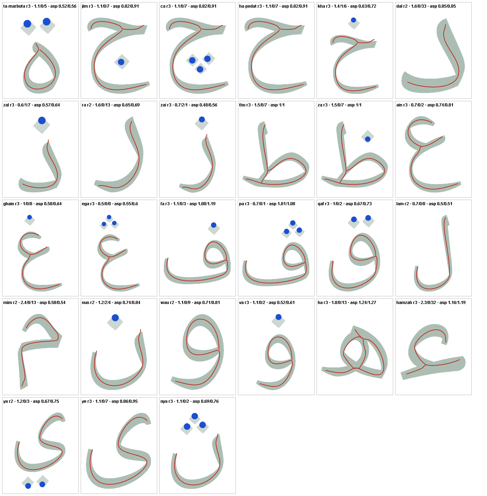

# Glyph-matched tracing models — delivery and verification

Implemented **4 October 2026**, Asia/Kuala_Lumpur, in two stages after the user's “proceed”:
the [glyph-matched plan](GLYPH_MATCHED_TRACING_MODELS_IMPLEMENTATION.md), then the
[loop-fidelity plan](LOOP_LETTER_GLYPH_FIDELITY_IMPLEMENTATION.md) for the letters the user
found still wrong (Qaf, Fa, Pa, Hamzah, Wau, Va, Ha ه, Ha ح, Ca, Kha). The decisions in both plans
were taken at their recommended defaults; the optional glyph silhouette was **not** added.

## What changed

27 tracing models were redrawn from the centreline of the catalogue glyph (Noto Naskh Arabic, the
font **Isi kandungan** shows): the 17 Redraw letters, 8 of the 10 Refine letters, and Fa and Pa.
Sa and Syin already met the acceptance numbers and keep their approved models. Geometry came from
`scripts/trace-glyph-centreline.mjs` and the plan in `scripts/glyph-trace-plan.json`: the shape follows
the catalogue; stroke order, direction and pen lifts are **proposals for your review**, not what the
font specifies.

Every revised letter was delivered `pendingReview`, with no current-geometry review. Letters that were
approved moved to a new content revision; letters already unreviewed (Qaf, Tho, Za) kept their revision.
Name recordings, recording versions and independent audio approvals are untouched. After testing them in
the app the project owner wrote “okay it works, I approve all the alphabet”, recorded on 2026-10-04 in
[the approval record](CONTENT_APPROVALS.md#approval-of-glyph-matched-models-2026-10-04) for all 29
revisions then pending (these 27 plus Kaf and Ga). Nothing was approved before that message.

A second change makes the Jejak Ceria guide match the letter's weight. The game drew every guide at
width 76 while the catalogue stroke is about 42–45 units, which filled loops (Qaf lost its counter
entirely; Wau, Va, Ha ه kept under half). Strokes can now author `displayWidth` (30–76, default 76,
validated in [validateContent.js](../src/content/validateContent.js)); the play guide and the accepted
progress fill use it ([displayWidth.js](../src/content/displayWidth.js)). Matching tolerances, start/end
radii, the guided corridor and the precision guide do not use it, so no letter is harder to complete.
The tool chose the widest value in 44–76 at which every counter survives and the guide is at most 1.25×
the ink area. All 27 revised letters carry one (46–58); the eight approved letters keep 76.

| Letter | Revision | Strokes | Guide width | Mean / stray / uncovered / shape95 (%) | Counter retained | Overlap / weight |
| --- | --- | --- | ---: | --- | --- | --- |
| Ta marbutah | 2 → 3 | 1 → 1 | 46 | 1.1 / 0 / 5 / 2 | 0.94 | 0.75 / 1.23 |
| Zal | 2 → 3 | 1 → 1 | 52 | 0.6 / 1 / 7 / 1.2 | — | 0.77 / 1.24 |
| Ra | 1 → 2 | 1 → 1 | 52 | 1.6 / 0 / 13 / 2.7 | — | 0.73 / 1.2 |
| Zai | 2 → 3 | 1 → 1 | 48 | 0.7 / 2 / 1 / 1.4 | — | 0.75 / 1.23 |
| Ain | 2 → 3 | 1 → **2** | 52 | 0.7 / 0 / 2 / 1.7 | — | 0.73 / 1.25 |
| Ghain | 2 → 3 | 1 → **2** | 50 | 1 / 0 / 0 / 2.4 | — | 0.67 / 1.22 |
| Qaf | 2 → 3 | 2 → 2 | 50 | 1 / 0 / 2 / 2.1 | 0.88 | 0.72 / 1.25 |
| Lam | 1 → 2 | 1 → 1 | 50 | 0.7 / 0 / 0 / 1.4 | — | 0.75 / 1.21 |
| Mim | 1 → 2 | 2 → **1** | 50 | 2.4 / 0 / 13 / 4.3 | — | 0.64 / 1.2 |
| Nun | 1 → 2 | 1 → 1 | 46 | 1.2 / 2 / 4 / 1.8 | — | 0.71 / 1.25 |
| Wau | 1 → 2 | 1 → 1 | 50 | 1.1 / 0 / 9 / 2.2 | 0.81 | 0.76 / 1.22 |
| Va | 2 → 3 | 1 → 1 | 50 | 1.1 / 0 / 2 / 2.4 | 0.83 | 0.72 / 1.24 |
| Ha (ه) | 2 → 3 | 1 → 1 | 50 | 1.8 / 0 / 12 / 3.6 | 0.76, 0.72 | 0.76 / 1.12 |
| Hamzah | 2 → 3 | 1 → **2** | 50 | 2.3 / 0 / 32 / 5 | — | 0.72 / 1.21 |
| Ya | 1 → 2 | 1 → 1 | 50 | 1.2 / 0 / 3 / 2.6 | — | 0.69 / 1.24 |
| Ye | 2 → 3 | 1 → 1 | 50 | 1.1 / 0 / 7 / 2.6 | — | 0.75 / 1.21 |
| Nya | 2 → 3 | 1 → 1 | 48 | 1.1 / 0 / 2 / 1.7 | — | 0.72 / 1.25 |
| Jim | 2 → 3 | 1 → **2** | 54 | 1.1 / 0 / 7 / 2.1 | — | 0.72 / 1.23 |
| Ca | 2 → 3 | 1 → **2** | 54 | 1.1 / 0 / 7 / 2.1 | — | 0.72 / 1.23 |
| Ha (ح) | 2 → 3 | 1 → **2** | 54 | 1.1 / 0 / 7 / 2.1 | — | 0.72 / 1.23 |
| Kha | 2 → 3 | 1 → **2** | 52 | 1.4 / 1 / 6 / 3 | — | 0.65 / 1.22 |
| Dal | 1 → 2 | 1 → 1 | 58 | 1.6 / 0 / 33 / 3.2 | — | 0.77 / 1.24 |
| Ta (ط) | 2 → 3 | 2 → 2 | 58 | 1.5 / 0 / 7 / 2.8 | 0.74 | 0.72 / 1.25 |
| Za | 2 → 3 | 2 → 2 | 58 | 1.5 / 0 / 7 / 2.8 | 0.74 | 0.72 / 1.25 |
| Nga | 2 → 3 | 1 → **2** | 52 | 0.5 / 0 / 0 / 1.3 | — | 0.72 / 1.25 |
| Fa | 2 → 3 | 2 → 2 | 52 | 1.1 / 0 / 3 / 2.4 | 0.82 | 0.74 / 1.24 |
| Pa | 2 → 3 | 2 → 2 | 54 | 0.7 / 0 / 1 / 1.7 | 0.77 | 0.77 / 1.25 |

**Structure changes for your review** (bold above): Ain, Ghain, Hamzah, Jim, Ca, Ha (ح), Kha and
Nga went from one stroke to two (head or bar first, then the body from the join); Mim went from two
strokes to one (arch, base bar and tail). Fa and Pa's head loops close exactly where they start so the numbered guides show one shared start/stop badge (an earlier version left a 3–8 unit gap that stacked badges).
Ha (ه) is one stroke in the order the owner drew on a screenshot: from the top down the middle line to the bottom crossing, up round the left side, over the top and down the big right arc, then back left through the crossing to the tail. The path crosses itself at the top and bottom, as the catalogue letter does. Ta (ط)/Za now trace the stem through the foot to the base, so
the loop closes as in the catalogue. Dot counts, tap-only policy and tolerances are unchanged. Qaf, Fa and
Pa keep head loop then tail then dots.

## Student access

With the owner's approval all **37 lessons** are student-ready: every model has an approved current
revision and an approved recording. Huruf permulaan has its original 12 models and Huruf tambahan its 6.
An earlier completion does not complete a revised letter (revisions already gate stickers). While the
models were pending, pupils had only the 8 earlier-approved lessons; the unit tests still check that an
unreviewed revision stays out of student and challenge pools.

## Verification

Environment: Windows, Node 24.19.0, Playwright 1.63.0, Chromium (revision 1243) on the dev server
`http://127.0.0.1:5173`. WebKit, Firefox and physical devices were **not** run for this change (recorded
Windows limits apply).

| Check | Scope and result | Evidence |
| --- | --- | --- |
| `npx vitest run` | 156 tests pass. New `tests/game/glyphMatched.test.js` checks that every other entry and all 64 recording files are byte-identical to the pre-change snapshot, one revision bump per changed letter (none for already-unreviewed ones), valid structure, dot counts, pools, stale completions and `displayWidth`. Three hard-coded “35 ready” counts now derive from the catalogue. | [baseline](../tests/fixtures/glyph-baseline.json) |
| `npm run build` | Content validator (37 valid models, 8 student-ready lessons) and production compilation passed after the last data and code change. | — |
| `scripts/compare-model-to-glyph.mjs --check` | All 27 revised letters meet every number: mean ≤ 3.5%, stray ≤ 30%, uncovered ≤ 35%, aspect ±20%, dots equal, 95th-percentile shape distance ≤ 6%, counters equal in number and 70–130% of area at the game width, overlap ≥ 0.5, weight ≤ 1.25. Unchanged letters keep their earlier measurements. | [metrics-after.json](../output/verification/glyph-model-audit/metrics-after.json), [comparison-summary.json](../output/verification/glyph-model-audit/comparison-summary.json), [counter audit before](../output/verification/glyph-model-audit/counter-audit-before-loop-fidelity.json) |
| `tests/browser/glyph-matched.spec.js`, Chromium | First stage: all 25 letters redrawn then in Jejak Ceria, guided and precision, with wrong start, endpoint tap, chord shortcut (where the chord leaves the route), reversal, cancellation, missing dots, retry, the demonstration and an unchanged viewBox. Second stage: every letter's play-mode completion, negatives and demonstration plus the play guide and progress-fill widths (81 cases); then Fa, Pa, Qaf, Tho and Za in all three modes (30 cases) and the single-stroke Ha in all three modes plus its demonstration (7 cases) after their last geometry change, and three closed-loop cases (Qaf, Fa, Pa) checking that a loop that ends where it starts shows one start/stop badge. All passed. | spec file |
| After the owner's approval, Chromium | `check-content`/`npm run build`: 37 valid models, 37 student-ready lessons; 156 unit tests. Browser: the student catalogue shows 37 lessons with no preview banner; eight revised letters (Qaf, Ha ه, Fa, Hamzah, Mim, Wau, Kha, Za) complete as real, non-preview attempts at their approved revisions; every letter's play-mode completion and the Kaf/Ga specs (updated to read approval state from the catalogue) pass — 63 cases. | spec files |
| Captures | 12 letters at 320×600, 390×844, 768×1024, 1024×768, 1920×1080 and 3840×2160: 72 captures, no page errors, no Menu overlap, letter inside board, no page scrolling. The 390×844, 1024×768 and 4K montages were inspected: loops are open and the letters read as the catalogue forms. | [captures](../output/verification/glyph-model-audit/captures/) |

The check initially accepted a broken Qaf head loop because it only measured ink coverage; the
loop-fidelity plan added the shape-distance, counter, overlap and weight checks above. It also flagged
Ta marbutah, Wau, Va, Ha ه, Tho, Za, Fa, Pa and Qaf at the old width 76. Sad and Dad (approved, unchanged)
and the other approved letters still fail some of the new numbers at width 76; they were left alone.

### Existing browser specs

A Chromium run of the existing specs after the first stage failed 143 of 315 cases. Causes: specs that
open now-unreviewed letters as student lessons or count lessons; Ghain, Mim and Ha changing structure;
and failures present before this work. The mechanics specs (android, book, endpoint-finish,
fullscreen-layout, low-spec, numbered-guides, solo-duo, tracing-terminal, ui-theme, ui-zoom) now serve the
catalogue with every model marked approved through [readyCatalogue.js](../tests/browser/helpers/readyCatalogue.js)
(browser only; `letters.json` is untouched and the real gate is covered by the unit tests, the gating
specs and `glyph-matched.spec.js`). Counts derive from the catalogue, the Ghain endpoint cases use Nun, and
the Mim and shared-loop cases use Qaf.

One real defect surfaced: the numbered label “1 Mula” for the taller Lam sat under the letter badge at
320×600. [numberedGuides.js](../src/tracing/numberedGuides.js) now treats the stage Menu button and letter
badge as obstacles when placing labels; the “all 37 complete letter envelopes and guides fit” cases then
passed at every tested width.

The repeated Chromium run of 214 existing cases (branding and `letter-batch-*` excluded as stale) passed 182
and failed 32 before the last two fixes. Those two fixes (the fullscreen-layout catalogue count and the
book-end lesson count) were re-run and pass, except one case. The remaining failures are not caused by this change:

- `game` (6): the same six fail with the original catalogue restored; `fullscreen-layout`
  “fitted menus … 320x600” (teacher panel overflows 15 px) fails identically with the original catalogue.
- `draft-audio` (4), `audio-approval` (1), `ui-theme` (4), `ui-zoom` (1): the cases already recorded as
  failing in [PROJECT_STATE.md](PROJECT_STATE.md) before this work.
- `fullscreen-tracing-audio` (1): the unverified fullscreen/music work, deliberately not examined.
- `branding` (6) and `letter-batch-1/2/3`: not re-run; they fail because of a changed welcome heading and
  stale catalogue paging, which this change did not touch.

Results: [first run](../output/verification/glyph-model-audit/regression-chromium.json) and
[repeat](../output/verification/glyph-model-audit/regression-chromium-2.json).

## Not done

- WebKit, physical devices and a teacher or pupil review. The owner approved the drawings; no teacher
  assessment was supplied.
- Production preview and Android asset sync (the offline package and the signed 1.0.5 release still
  contain the earlier models).
- Fullscreen tracing/voice/music verification, deliberately left out at the user's request.
- The optional font silhouette for an identical outline.
- Applying the width and gate treatment to the eight letters that were approved earlier and never
  redrawn (Alif, Ba, Ta, Sa, Sin, Syin, Sad, Dad); this would change approved lessons and needs a decision.
