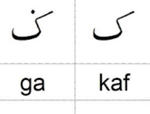

# Kaf and Ga — reference-matched letter models

**Prepared:** 3 October 2026, Asia/Kuala_Lumpur.  
**Status:** Implemented after the user's explicit “proceed with implementation”
on 3 October 2026. Kaf revision 2 and Ga revision 3 await fresh geometry review;
35 other lessons and all audio approvals remain current. See [the delivered
review sheet and technical verification](KAF_GA_SHAPE_CORRECTION_VERIFICATION.md).
The design and sequence below record the original implementation proposal.

## Requested result

Kaf must look like the **right-hand letter** in the supplied image, both before
and after opening its tracing page. Ga must have **that same Kaf body plus one
dot above**, as shown on the left.

The image is preserved unchanged as a documentation reference. It sets the
requested appearance; it does not provide stroke direction or pen-lift rules.

## Original mismatch before implementation

The catalogue currently renders `letter.glyph` through a font. Tracing instead
renders the authored paths in `src/content/letters.json`. Those representations
do not currently agree for Kaf.

Both current tracing bodies have a tall right stem, a broad lower bowl and a
separate inner chevron. Ga adds a dot to that body. The requested reference has
a **connected slanted upper arm, bent descending section and curved lower
base**, with no detached inner chevron.

| Entry | Current content revision | Proposed content revision | New model |
| --- | --- | --- | --- |
| Kaf (`kaf`) | 1, owner-approved | 2 | One connected reference-matched body; no dots |
| Ga (`ga`) | 2, owner-approved | 3 | The identical body; exactly one dot above |

These revisions assume the source remains at the versions inspected for this
plan. Confirm them again before implementation.

## Geometry design

1. Author a clean centreline in the existing **1000 × 1000 logical frame**.
   Match the reference's proportions: diagonal upper arm, distinct elbow,
   descending section, shallow curved base and short rising left end.
2. Replace the existing body and detached chevron with **one continuous body
   stroke**. Remove the old inner stroke from `displayPaths`, `strokes` and
   `validSequences`; it must not remain as a decoration, invisible requirement
   or completion condition.
3. Store the same body path, stroke width and movement settings in Kaf and Ga.
   The JSON catalogue remains the source of truth; do not draw an independent
   approximation in either screen or use a font outline as the matcher route.
4. For Ga, position one distinct dot above the upper shoulder/elbow, following
   the reference. Keep it separated from the slanted arm and outside the lower
   body. Render it at a readable size using the game's established dot style.
5. Retain the existing tap-only dot policy, equivalent dot button and target
   tolerances. Adjust the dot's position to the new body. Kaf has no dot target.
6. Use the existing rounded preschool tracing presentation. Simplifying the
   printed line weight must preserve the reference's silhouette, connections
   and distinguishing dot.

**Proposed writing sequence for review:** start at the upper-right end of the
slanted arm, follow through the elbow and descending section, continue around
the lower curve and finish at the left end. Kaf then completes. For Ga, lift
the finger and place the upper dot. This is an authoring proposal, not a claim
that the reference image specifies the correct teaching direction.

## Consistent display across the game

Add a small reusable model illustration component, provisionally
`src/components/LetterModelGlyph.jsx`. For **Kaf and Ga**, it displays the
catalogue's paths and dot targets with a uniform aspect ratio and suitable
padding. Other letters keep their current presentation.

Use this illustration wherever these two letters appear as a teaching example:

- letter selection cards;
- **Kenal huruf** help and any copying reference;
- teacher content and draft-model review previews;
- the large letter beside audio-review information;
- any standalone completion illustration that currently falls back to a font.

The tracing board, demonstration, assisted fill and play completion already use
the model geometry; they should pick up the revised paths through the catalogue.
Check every affected state rather than adding another rendering source.

Keep letter IDs, names and semantic glyph metadata for identity and exports.
No Unicode substitution is proposed. Native select options cannot contain SVG;
use the Latin names **Kaf** and **Ga** for these two options, with the consistent
model shown in the adjacent preview. Avoid displaying a conflicting font form
as the learning example.

The compact renderer needs its own complete-letter fit, including Ga's dot.
Reuse the existing fit calculation where appropriate; preserve uniform scale,
legibility and the new fullscreen/no-scroll layout.

## Tracing, guidance and saved work

- Numbered cues derive from the revised sequence. Kaf has start/follow/finish
  cues on its continuous body. Ga has body cues followed by a separately
  numbered dot. Do not keep obsolete chevron numbers or pen-lift instructions.
- Demonstration animates the connected body and, for Ga, the dot after a lift.
  Jejak Ceria remains the preschool default. Guided and precision modes must
  accept the same intended shape without changing global matcher tolerances.
- Completion requires the whole new body. Ga additionally requires its one
  dot. A shortcut across the elbow, an endpoint jump, reverse tracing or a missing
  dot must not earn completion.
- Existing fit logic must contain the entire new body, numbered guides and dot
  without moving the letter when progress or completion changes.
- Preserve all stored attempts, copies and match records with their original
  revisions. Do not rewrite old drawings or mark them as attempts on the new
  model. Existing completion-sticker logic already checks content revisions;
  verify that old Kaf/Ga completions do not complete the new revisions.
- Preserve original-coordinate copying, unsaved-copy guards, page flips,
  equal Duo stages, shared pauses and scoring rules.

## Revised-content review

This is a geometry correction, not an approval-only change. The applicable
[repository instructions](../AGENTS.md) state:

> A geometry change needs a new content revision and fresh review.

On implementation, increment only Kaf/Ga's content revisions, set their revised
geometry to `pendingReview` and remove stale current-geometry review metadata.
Preserve the historical approval entries. The existing adult preview can show
the revised models for review; student lessons and scored challenge pools must
continue to respect the existing readiness gate.

After the actual revised drawings and sequence have been reviewed, record the
real reviewer, review date, reference and exact revisions. Project-owner approval
must be labelled as such; do not invent teacher approval. A later **proceed**
authorises implementation, and does not by itself assert review of geometry
that has not yet been produced.

While these two revisions await review, the other **35 approved lessons** remain
available. Existing Kaf/Ga name recordings, recording versions and independent
audio approvals stay unchanged. Do not regenerate or reapprove them merely
because the handwriting body changes.

## Planned file changes after authorisation

| File/area | Purpose |
| --- | --- |
| `src/content/letters.json` | Revise only Kaf/Ga paths, dot placement, sequence, content versions and geometry review state. |
| New `src/components/LetterModelGlyph.jsx` | Reuse the catalogue model for consistent Kaf/Ga illustrations. |
| `src/components/LetterCard.jsx` | Show the corrected model in selection cards. |
| `src/screens/BookLessonScreen.jsx` | Use the same model in letter help/reference. |
| `src/components/AudioReviewPanel.jsx` | Consistent adjacent preview and name-based Kaf/Ga select options; preserve audio behaviour. |
| `src/screens/TeacherScreen.jsx`, `src/components/DraftModelReview.jsx` | Show the same revised model during review. |
| `src/screens/ResultScreen.jsx` | Replace any affected font-only completion fallback. |
| Relevant styles | Fit the illustration inside existing cards, help and review layouts. |
| Targeted content/geometry and browser tests | Verify shared body, dot distinction, complete tracing, display consistency, versions and fit. |
| Current review/state documents | Record the correction and genuine review outcome after implementation; retain historical evidence. |

The tracing renderer, guide generator, matcher and readiness validator should
remain reusable. Modify them only if the corrected models expose a specific
failure; do not bypass validation or broaden tolerances to make the model pass.

## Verification after implementation

Follow [VERIFICATION_GUIDE.md](VERIFICATION_GUIDE.md), using existing tracing
and navigation helpers. Run `npm test` and the checked `npm run build` after
affected edits; the build already performs content validation.

Select focused checks that establish:

1. Kaf and Ga share exactly the same body; Kaf has no dots and Ga has one upper
   dot. The old detached chevron and its movement requirement are absent.
2. Valid continuous tracing completes Kaf. Ga remains incomplete until its dot
   is placed; direct tap and equivalent dot-pad actions both work. Exercise
   the elbow, invalid shortcuts, reversal, interrupted input and clean retry.
3. Jejak Ceria, guided, precision, demonstration, copying and completion use the
   intended shape. Numbered guides reflect the new movement/dot sequence.
4. Menu, lesson/help, completion and teacher/audio previews agree visually
   with the user image. Inspect Kaf and Ga side by side, with guides both shown
   and hidden; a structural path test alone does not establish teaching accuracy.
5. Screens remain fitted at 390 × 844, 1024 × 768, 768 × 1024, 1920 × 1080
   and native 3840 × 2160. Check the dot/guide clearance, stable completion and
   equal Duo lanes. Use the documented native-DPR 4K browser setup.
6. Revised models remain excluded from student/scored pools until approval.
   After genuine approval, complete both as student lessons and in Solo/Duo,
   checking fresh saved revisions, page navigation and trophies.
7. Old attempts/copies/matches remain intact; old completion stickers do not
   carry over to the revised models. Export retains original historical records.
8. All other 35 entries and all recording bytes/approval metadata are unchanged.
   Recompute SVG screen coordinates after resizing or capturing the page.

Record commands, tested revisions/build, browser/viewport/input type, outcome
and relevant protected-file comparisons. Physical smartboard/tablet review
remains a separate check if a device is available.

## Implementation sequence

1. Snapshot the current Kaf/Ga entries, independent audio metadata and unaffected
   content before editing.
2. Author and preview the shared connected body and Ga's upper dot.
3. Apply new content revisions and pending-review state.
4. Integrate the shared display component and update numbered/demo behaviour
   through the revised sequence.
5. Run focused checks and produce a review sheet comparing the supplied image,
   both new models and their proposed writing sequence.
6. Record actual geometry approval when supplied; then verify student and
   competitive journeys and update current documentation.

## Scope boundary

This plan addresses Kaf/Ga shape consistency only. The dragging/text-selection
behaviour observed in `problem.mp4` is a separate issue and is not bundled into
this requested correction. No unrelated letter redesign, audio change, theme
revamp, APK rebuild, commit/push or deployment is proposed here.

**Document-first stage (completed):** the document, reference and links were
reviewed without applying changes. The subsequent explicit implementation
authorisation enabled the delivered correction; it did not approve unreviewed
new geometry or change independent audio approvals.
