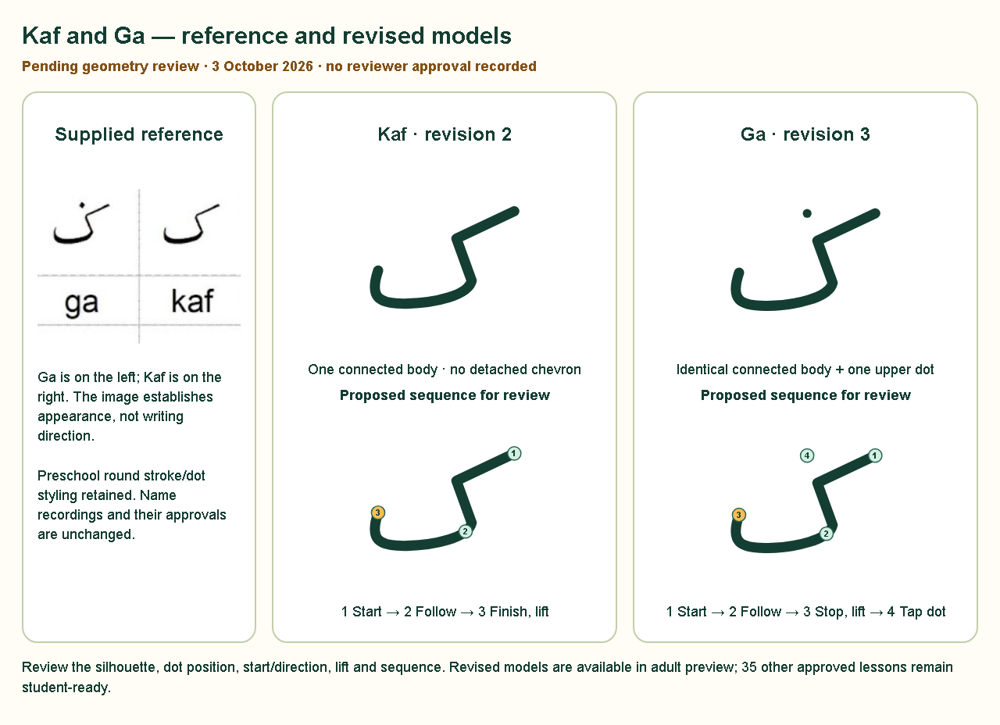

# Kaf and Ga — delivered correction and verification

Implemented **3 October 2026**, Asia/Kuala_Lumpur, after the user's explicit
“proceed with implementation”. The [implementation document](KAF_GA_SHAPE_CORRECTION_IMPLEMENTATION.md)
and [unchanged supplied image](references/kaf-ga-user-reference.png) define the scope.

Kaf **revision 2** has one continuous connected body: slanted upper arm, elbow,
descending section, curved base and rising left end. The detached inner chevron
and its movement requirement are removed. Ga **revision 3** uses the identical
body and one upper dot. Dot radius, tap policy, hit tolerance and travel limit
are preserved; only its position changed.

The reusable [LetterModelGlyph](../src/components/LetterModelGlyph.jsx) draws
the catalogue paths and dot targets with the existing complete-letter fit.
Selection cards, lesson help (also reachable during copying), teacher content,
draft review, audio review and standalone strict/copy completion use this
illustration for Kaf/Ga. Audio select options use their Latin names. Semantic
glyphs and IDs remain unchanged. Tracing, demonstration, assisted fill and
numbered cues derive directly from the revised catalogue sequence.

## Review sheet and content status

Both new geometry revisions are **pendingReview**, with stale geometry-review
metadata removed. Historical approvals remain unchanged. The authoring sequence
is proposed for review: start at the upper-right tip, follow the elbow and lower
base, finish on the left and lift; Ga then adds its separately numbered dot.
The supplied image establishes appearance, not teaching direction.

Adult preview offers both revised models. The existing readiness gate excludes
them from student lessons and scored Solo/Duo pools; **35 other lessons remain
student-ready**. All 37 independent recording revisions and audio approvals
remain current. Implementation authorisation is not geometry approval, and no
teacher or owner review of these new revisions has been invented.

## Technical verification

Production preview at **http://127.0.0.1:4173** was reused after its HTML matched
the new `dist/index.html`. Tested production assets are `index-DHV_yvMX.js` and
`index-CKMiDR1f.css`. Node **24.19.0**, Playwright **1.63.0**, Chromium revision
**1243** and WebKit revision **2359** were used. The missing test-browser binaries
were installed into the ignored workspace dependency cache; the initial launch
failures are retained as environment evidence, not counted as application tests.

Final review also preserved the original SVG frame and font metadata for other
letters in the reusable draft-review component. Its scoped unit check and
checked build passed after that fix. The production JavaScript/CSS hashes are
identical to the browser-tested build, so the browser evidence remains current.

| Check / command | Scope and final result | Evidence |
| --- | --- | --- |
| `npm test` | Initial suite: 89 passed, one old pool-size expectation failed. Scoped match follow-up passed all 16 checks. Final Kaf/Ga selection passed five checks, including two added checks. **92 unique unit checks verified**, nine files; no unresolved failures. | [Initial suite](../output/verification/kaf-ga/unit.txt), [match follow-up](../output/verification/kaf-ga/unit-followup.txt), [final correction checks](../output/verification/kaf-ga/unit-kaf-ga-final.txt) |
| `npm run build` | Content validator and production compilation passed; 37 valid models, 35 ready lessons. | [Checked build](../output/verification/kaf-ga/build.txt) |
| Focused Kaf/Ga Chromium/WebKit tests | **37 unique cases passed**, one expected WebKit skip for Chromium CDP touch. All initial assertion failures were recovered by scoped follow-ups; no application failure remains. | [Main run](../output/verification/kaf-ga/browser-installed.json), [strict/copy follow-up](../output/verification/kaf-ga/browser-followup.json), [final display selection](../output/verification/kaf-ga/browser-display-final.json) |
| Existing Duo/Solo regressions | **12 passed** in Chromium/WebKit: equal Duo stages and small-space recovery on both tablet orientations, desktop and native 4K; Solo trophies/export/reset; shared held-gesture pause/recovery. | [Regression report](../output/verification/kaf-ga/browser-regression.json) |
| `node scripts/verify-kaf-ga.js` | Pre-geometry snapshot comparison: only Kaf/Ga catalogue entries differ; 35 complete entries, 37 audio metadata records, 37 active recording files, historical approvals and other protected inputs are unchanged. Captures the source-derived review sheet. | [Protected comparison](../output/verification/kaf-ga/protected-comparison.json), [review metadata](../output/verification/kaf-ga/review-sheet.json) |

Browser commands use `--config=playwright.fullscreen.config.js
--project=chromium --project=webkit --workers=2`, with `JAWI_LAYOUT_DPR=1`.
`PLAYWRIGHT_BROWSERS_PATH` points to `node_modules/.cache/ms-playwright` inside
the workspace. The main selection is `tests/browser/kaf-ga.spec.js`.
Follow-ups select `guided: continuous|precision: continuous|demo uses|catalogue, help`,
then only `catalogue, help`. Existing regression selection uses
`tests/browser/fullscreen-layout.spec.js tests/browser/solo-duo.spec.js` and
`Duo has equal fitted stages.*(1024x768|768x1024|1920x1080|3840x2160)|Solo challenge completes|shared pause cancels`.
All commands, final test statuses and input hashes are recorded in
[the summary](../output/verification/kaf-ga/verification-summary.json) and
[fingerprints](../output/verification/kaf-ga/input-fingerprints.json).

The focused checks establish:

- Continuous tracing completes each revised model in play, guided and precision
  modes, preserving its new saved revision and pending geometry status.
- Ga remains incomplete after its body until a separate direct dot tap or
  equivalent dot-pad action. Chromium native emulated touch completes body/dot.
- Endpoint taps, a finely sampled chord across the elbow, reversal and pointer
  cancellation cannot complete; clean retry succeeds without changing matcher
  tolerances. The continuous body has three cues; Ga's dot is number four.
- Demonstration cannot score input. Original 1000-unit copying coordinates and
  unsaved-copy protection are retained. Old attempts, copies and match revisions
  round-trip/export intact; old completion stickers do not transfer.
- Catalogue, help, teacher/audio illustrations and standalone strict/copy
  completion use the new body and correct dot distinction. Fresh captures were
  inspected against the supplied image and review sheet.
- Model paths, dot targets and guide labels fit at **390 × 844, 1024 × 768,
  768 × 1024, 1920 × 1080 and 3840 × 2160**, with DPR 1. Guides shown/hidden,
  Ga's dot stage and stable completed states were captured. Document size equals
  the viewport, with no scroll. SVG coordinates are reacquired after captures.

Local application captures are under `output/verification/kaf-ga/`, named by
browser, viewport, letter and state. The review-sheet PNG above is retained in
documentation for review. Evidence applies to these tested inputs; a future
geometry, dependency, shared-module or approval change requires the affected
checks again.

## Remaining review

Actual reviewer/date/reference approval of **Kaf revision 2 and Ga revision 3**
is still required before student/scored access. After that approval, record
the genuine review and verify student completion, new saved revisions, book
navigation and Solo/Duo journeys. Physical smartboard/tablet teaching review
was not available; emulated mouse/touch checks do not establish teaching accuracy.

Existing local edits are retained. No recordings were replaced, storage rewritten,
APK rebuilt, commit created, push performed or deployment published.
